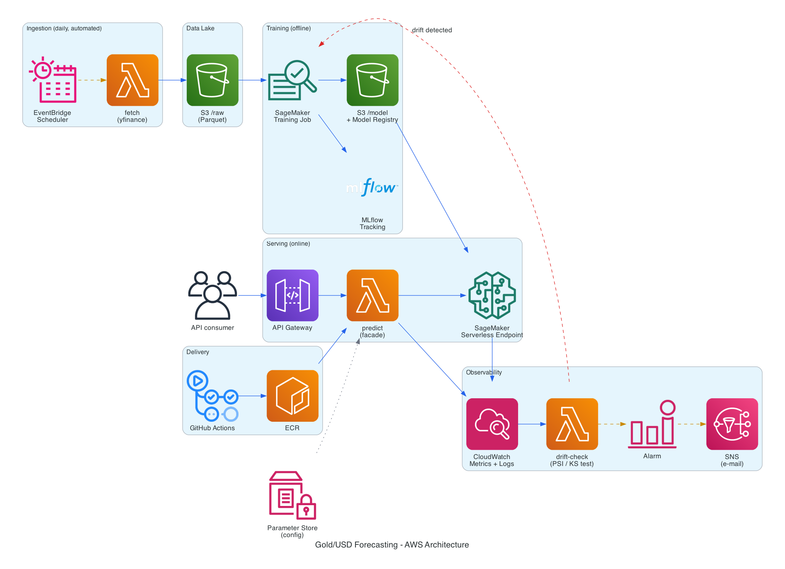
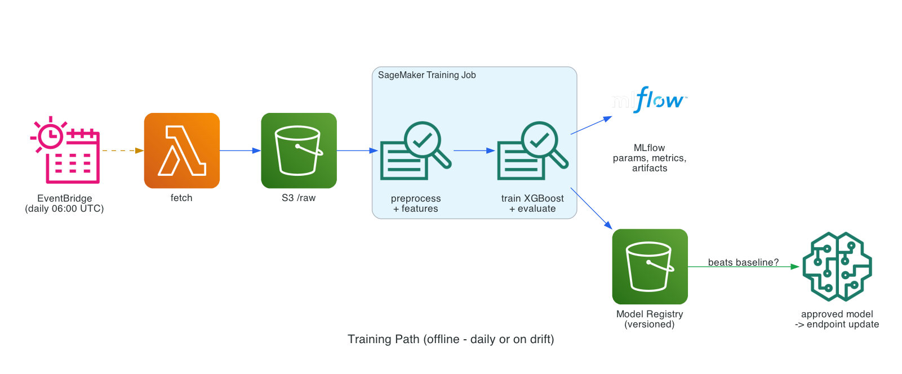
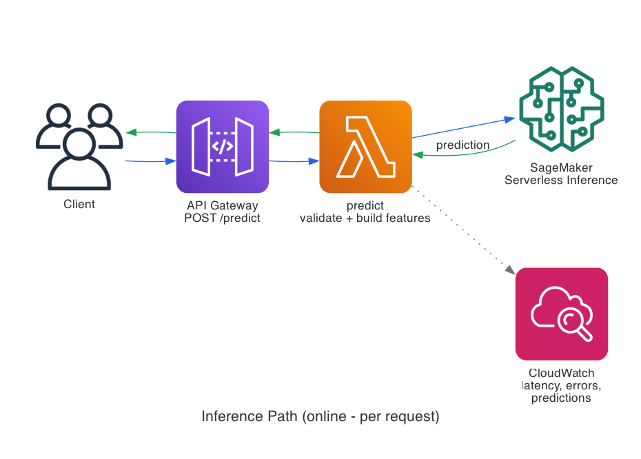

# Gold/USD Price Forecasting — End-to-End MLOps on AWS


> A production-shaped machine learning system that ingests Gold/USD market data daily,
> trains and versions a forecasting model, serves predictions through a REST API, and
> retrains itself when the incoming data drifts away from what it was trained on.

**Ironhack Data Science & AI — Final Project 2 (ML on Cloud).**
Built solo · Presentation: 5 October 2026

---

## Table of contents

- [Why this project](#why-this-project)
- [Architecture](#architecture)
- [Results](#results)
- [Getting started](#getting-started)
- [Project structure](#project-structure)
- [Documentation](#documentation)
- [Cost](#cost)
- [Credits](#credits)
- [License](#license)

---

## Why this project

Gold is a benchmark hedge against inflation and uncertainty, and its USD price moves with
currency strength, energy prices, equity sentiment and market volatility. Forecasting it is
a genuinely hard problem — financial series sit close to a random walk, which makes it an
honest test of whether a model has learned anything at all.

That honesty is the point of this project. Every model here is measured against a naive
baseline (*"tomorrow equals today"*). A model that cannot beat that baseline is reported as
not beating it.

The engineering goal is the other half: getting a model from a notebook into something that
runs on a schedule, serves requests, watches itself, and can be rebuilt from source by
someone who has never seen it.

## Architecture



The system separates into two paths that run on completely different clocks. Keeping them
apart is the central design decision:

### Training path — offline, daily or when drift is detected



EventBridge triggers a Lambda that pulls market data into S3 as Parquet. A SageMaker
Training Job builds features, trains the model and evaluates it. Parameters, metrics and
artifacts are logged to MLflow; the model itself is versioned in the SageMaker Model
Registry. A new model is only promoted if it beats the incumbent **and** the baseline.

### Inference path — online, per request, in milliseconds



A request reaches API Gateway, is validated and turned into features by a Lambda facade,
and is answered by a SageMaker Serverless Inference endpoint. No training happens here.

The facade exists so the public contract stays stable while the model behind it changes,
and so callers do not need AWS credentials to get a prediction.

### Architecture decisions

Every significant choice is recorded with its alternatives, its reasoning and its cost in
[`docs/decisions.md`](docs/decisions.md) — including the ones where the trade-off is
genuinely uncomfortable.

The diagrams above are generated from [`docs/diagrams/architecture.py`](docs/diagrams/architecture.py),
so they are versioned alongside the code rather than drifting away from it:

```bash
cd docs/diagrams && ../../.venv/bin/python architecture.py
```

## Results

> Not yet available — models have not been trained at the time of writing.
> This section will report RMSE and MAE for every candidate model against the naive
> baseline, with the evaluation protocol stated in full.

## Getting started

### Prerequisites

- Python 3.13
- An AWS account with credentials configured (`aws configure`)
- Terraform ≥ 1.15 (for the infrastructure)
- Docker (for the containerised model)
- Graphviz (`brew install graphviz`, only needed to regenerate diagrams)

### Local setup

```bash
git clone https://github.com/zeroKool1ne/mlops-on-aws.git
cd mlops-on-aws
python3 -m venv .venv
source .venv/bin/activate
pip install -r requirements.txt
```

### Running the API locally

> Coming soon — the FastAPI service is not implemented yet.

## Project structure

```
.
├── src/
│   ├── data/          # ingestion: market data -> S3
│   ├── features/      # feature engineering pipeline
│   ├── models/        # training, evaluation, model selection
│   ├── api/           # FastAPI service + Lambda handlers
│   └── monitoring/    # drift detection and retraining triggers
├── notebooks/         # exploratory data analysis
├── infra/             # Terraform: all AWS resources
├── docs/
│   └── diagrams/      # architecture diagrams as code
├── tests/             # pytest suite
└── .github/workflows/ # CI/CD
```

## Documentation

| Document | Contents |
|---|---|
| [Architecture decisions](docs/decisions.md) | Every design choice, its alternatives and its trade-off |
| Model card | Metrics, intended use, limitations, bias considerations — *pending* |
| AWS setup guide | Infrastructure walkthrough and cost estimate — *pending* |
| API reference | OpenAPI specification — *pending* |

## Cost

> Pending. This project is deliberately built on serverless components so that idle cost
> stays near zero: SageMaker Serverless Inference scales to nothing between requests, and
> no EC2 instance runs continuously. A full estimate will be published here.

## Credits

- **Data:** [Yahoo Finance](https://finance.yahoo.com/) via the [`yfinance`](https://github.com/ranaroussi/yfinance) package
- **Course:** [Ironhack](https://www.ironhack.com/) Data Science & AI bootcamp
- **Diagrams:** [`diagrams`](https://diagrams.mingrammer.com/) by mingrammer, using official AWS architecture icons

## License

Released under the MIT License — see [LICENSE](LICENSE).

---

**Disclaimer:** This project is an educational exercise in machine learning engineering.
Nothing here is investment advice, and the model's predictions should not be used to make
financial decisions.
